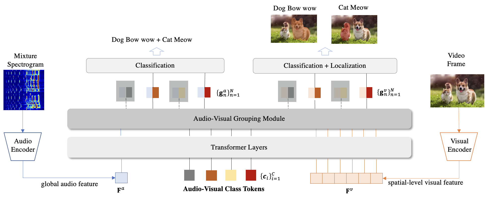

# [CVPR-2023] Audio-Visual Grouping Network for Sound Localization from Mixtures

AVGN is a new approach for disentangling category-wise semantic features for each source from the mixture and image to localize multiple sounding sources simultaneously.


<div align="center">
  
</div>


## Environment

To setup the environment, please simply run

```
pip install -r requirements.txt
```

## Datasets

###  MUSIC

Data can be downloaded from [Sound of Pixels](https://github.com/roudimit/MUSIC_dataset)

###  VGG-Instruments

Data can be downloaded from [Mix and Localize: Localizing Sound Sources in Mixtures](https://github.com/hxixixh/mix-and-localize)

###  VGG-Sound Source

Data can be downloaded from [Localizing Visual Sounds the Hard Way](https://github.com/hche11/Localizing-Visual-Sounds-the-Hard-Way)


## Train

For training the AVGN model, please run

```
python train.py --multiprocessing_distributed \
    --train_data_path /path/to/vgginstruments/train/ \
    --test_data_path /path/to/vgginstruments/ \
    --test_gt_path /path/to/vgginstruments/anno/ \
    --experiment_name vgginstruments_multi_avgn \
    --model 'avgn' \
    --trainset 'vgginstruments_multi' --num_class 37 \
    --testset 'vgginstruments_multi' \
    --epochs 100 \
    --batch_size 128 \
    --init_lr 0.0001 \
    --attn_assign soft \
    --dim 512 \
    --depth_aud 3 \
    --depth_vis 3
```

## Test

For testing and visualization, simply run

```
python test.py --test_data_path /path/to/vgginstruments/ \
    --test_gt_path /path/to/vgginstruments/anno/ \
    --model_dir checkpoints \
    --experiment_name vgginstruments_multi_avgn \
    --model 'avgn' \
    --testset 'vgginstruments_multi' \
    --alpha 0.3 \
    --attn_assign soft \
    --dim 512 \
    --depth_aud 3 \
    --depth_vis 3
```


## Citation

If you find this repository useful, please cite our paper:
```
@inproceedings{mo2023audiovisual,
  title={Audio-Visual Grouping Network for Sound Localization from Mixtures},
  author={Mo, Shentong and Tian, Yapeng},
  booktitle={Proceedings of the IEEE/CVF Conference on Computer Vision and Pattern Recognition},
  year={2023}
}
```
